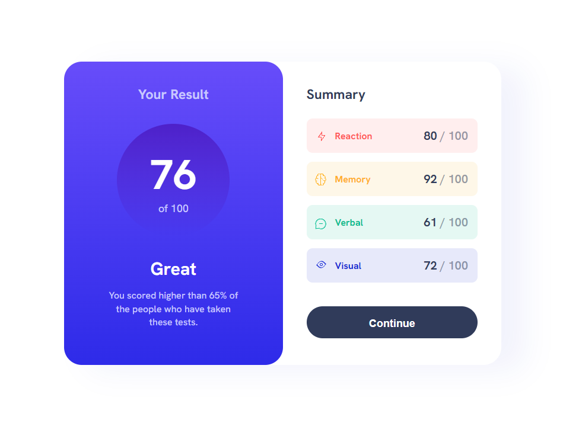

# Frontend Mentor - Results summary component solution

This is a solution to the [Results summary component challenge on Frontend Mentor](https://www.frontendmentor.io/challenges/results-summary-component-CE_K6s0maV). Frontend Mentor challenges help you improve your coding skills by building realistic projects. 

## Table of contents

- [Overview](#overview)
  - [The challenge](#the-challenge)
  - [Screenshot](#screenshot)
  - [Links](#links)
- [My process](#my-process)
  - [Built with](#built-with)
  - [What I learned](#what-i-learned)
  - [Continued development](#continued-development)
  - [Useful resources](#useful-resources)
- [Author](#author)
- [Acknowledgments](#acknowledgments)


## Overview

### The challenge

Users should be able to:

- View the optimal layout for the interface depending on their device's screen size
- See hover and active states for all interactive elements on the page

### Screenshot



### Links

- Solution URL: [Add solution URL here](https://your-solution-url.com)
- Live Site URL: [Add live site URL here](https://your-live-site-url.com)

## My process

### Built with

- CSS custom properties
- Flexbox
- CSS Grid
- Mobile-first workflow
- Custom CSS drawing with the icons

### What I learned

Mimic icon images with pure CSS using background linear gradient, box-shadow, border and border radius.

To see how you can add code snippets, see below:

```html
<i class="icon-1"></i>
```

```css
/* This is for the first icon Reaction on Summary section */
background-image: linear-gradient(
      180deg,
      hsl(var(--color-light-red)) 0%,
      hsl(var(--color-light-red)) 100%
    ),
    linear-gradient(
      180deg,
      hsl(var(--color-light-red)) 0%,
      hsl(var(--color-light-red)) 100%
    ),
    linear-gradient(
      180deg,
      hsl(var(--color-light-red)) 0%,
      hsl(var(--color-light-red)) 100%
    ),
    linear-gradient(
      180deg,
      hsl(var(--color-light-red)) 0%,
      hsl(var(--color-light-red)) 100%
    ),
    linear-gradient(
      125deg,
      rgba(255, 87, 87, 0) 75%,
      hsl(var(--color-light-red)) 77%,
      hsl(var(--color-light-red)) 80%,
      rgba(255, 87, 87, 0) 82%
    ),
    linear-gradient(
      125deg,
      rgba(255, 87, 87, 0) 35%,
      hsl(var(--color-light-red)) 37%,
      hsl(var(--color-light-red)) 42%,
      rgba(255, 87, 87, 0) 44%
    );
  background-position: 10px 10px, 9px 5px, 3px 13px, 8px 13px, -4px -10px,
    8px 10px;
  background-repeat: no-repeat;
  background-size: 5px 1px, 1px 6px, 5px 1px, 1px 7px, 14px 24px, 8px 14px;
```

## Author

- Website - [Jech](https://jerecho.com/)
- Frontend Mentor - [@j3rech0](https://www.frontendmentor.io/profile/j3rech0)

